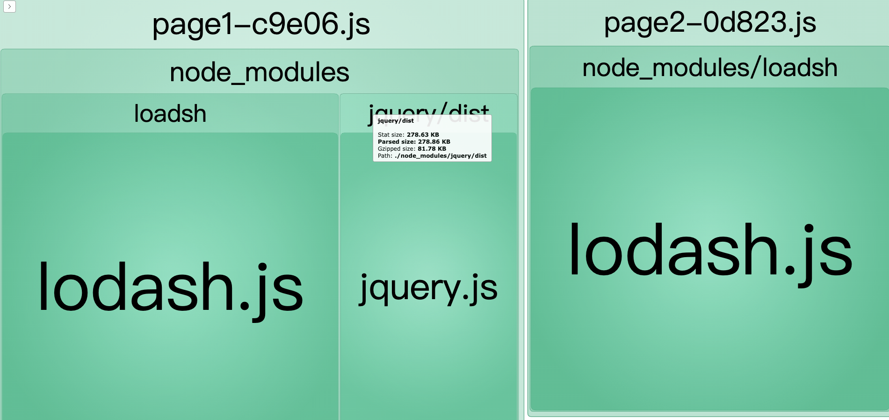
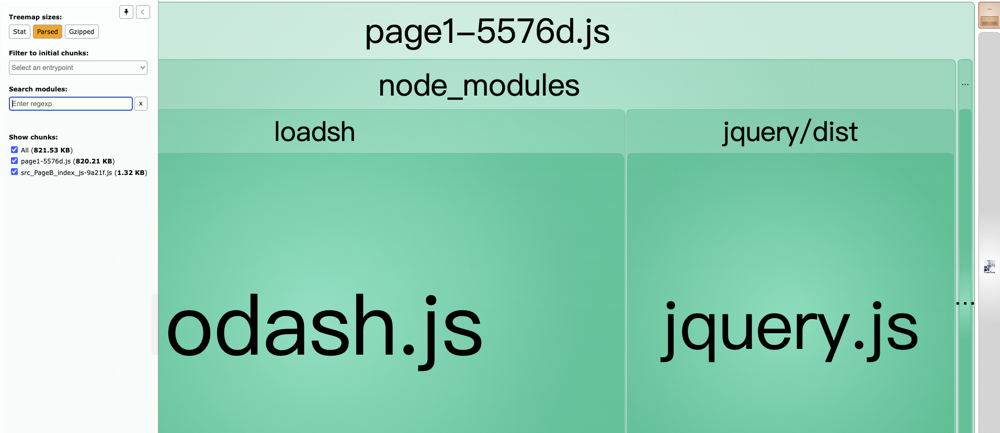
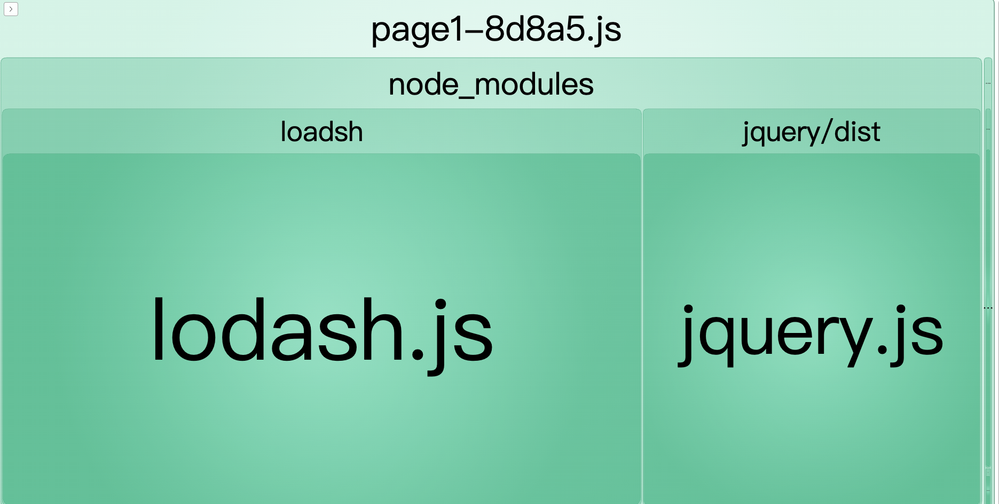
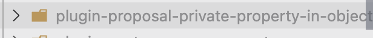
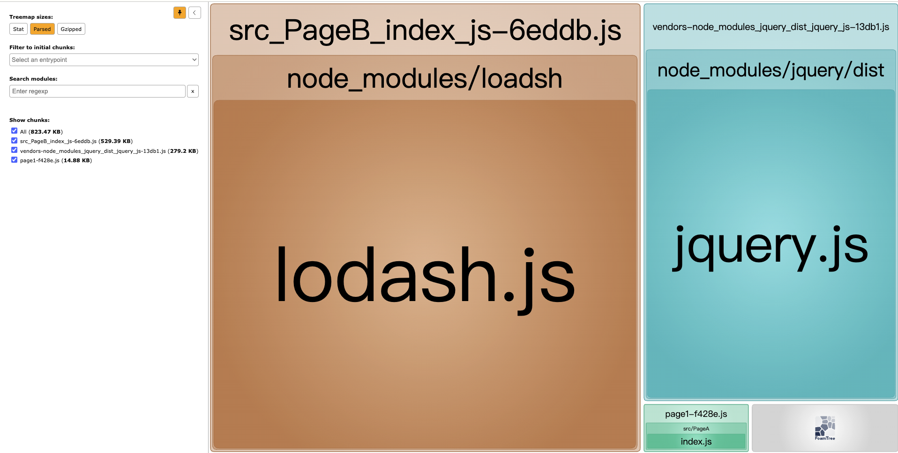
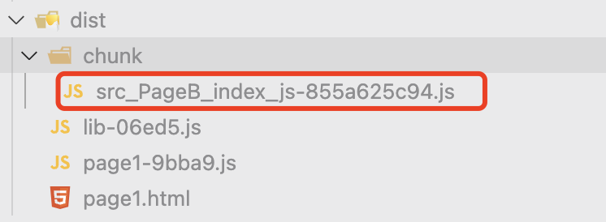
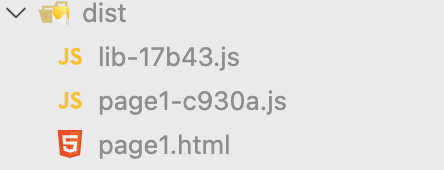

<!-- @import "[TOC]" {cmd="toc" depthFrom=2 depthTo=4 orderedList=false} -->

<!-- code_chunk_output -->

- [webpack splitChunk分包](#webpack-splitchunk分包)
- [参考链接：](#参考链接)
- [前置](#前置)
  - [webpack5中默认的分包策略](#webpack5中默认的分包策略)
- [splitChunks.cacheGroups](#splitchunkscachegroups)
  - [cacheGroups.test](#cachegroupstest)
  - [cacheGroups.priority](#cachegroupspriority)
  - [cacheGroups.reuseExistingChunk](#cachegroupsreuseexistingchunk)
- [splitChunks.chunks](#splitchunkschunks)
  - [async](#async)
    - [chunks: async 示例1.1](#chunks-async-示例11)
    - [chunks: async 示例1.2-1](#chunks-async-示例12-1)
    - [chunks: async 示例1.2-2](#chunks-async-示例12-2)
    - [chunks: async 示例1.3](#chunks-async-示例13)
  - [initial](#initial)
    - [chunks: initial 示例1.1](#chunks-initial-示例11)
  - [all](#all)
- [分包chunk的命名](#分包chunk的命名)
  - [针对splitChunk分包的命名](#针对splitchunk分包的命名)
  - [针对import()异步chunk的命名](#针对import异步chunk的命名)
- [补充：webpack是如何控制JS模块的加载顺序的？](#补充webpack是如何控制js模块的加载顺序的)

<!-- /code_chunk_output -->


## webpack splitChunk分包

## 参考链接：
https://juejin.cn/post/6844903680307625997?searchId=202310061134462AF5644FDA51D05F0721#heading-13
https://segmentfault.com/a/1190000042093955#item-3
https://www.cnblogs.com/kwzm/p/10315080.html

## 前置
### webpack5中默认的分包策略
```js
    // 将依赖模块（可以是npm包或者自己写的模块）分离出来作为单独的chunk
    splitChunks: {
        // async 针对异步加载的模块才进行分包
        chunks: 'async',
        //  将要被分离的模块，如果压缩前的体积小于xKB，那么不会被分离出来
        minSize: production ? 20000 : 1000,
        // 仅在剩余单个chunk时生效，避免分包后chunk体积过小，可以忽略，一般不手动配置
        minRemainingSize: development ? 0 : undefined,
        // 依赖模块被引用的次数>=1，才会被分离
        minChunks: 1,
        // 异步加载的最大并行请求数，如果>x，模块即便满足条件也不会被分离出来
        maxAsyncRequests: production ? 30 : Infinity,
        // 入口点的最大并行请求数，如果已经>x，模块即便满足条件也不会被分离出来
        maxInitialRequests: production ? 30 : Infinity,
        // 如果一个依赖的体积>xKB，将忽略minRemainingSize，maxAsyncRequests，maxInitialRequests配置，强制分离
        enforceSizeThreshold: production 50000 : 30000,
        // 被分离出的新chunk的命名连接符
        automaticNameDelimiter: "-",
        // 真正分离出chunk都是按照缓存组配置来的，按照优先级，如果一个模块满足缓存组的条件，那它将被划分到这个缓存组产生的chunk中
        cacheGroups: {
            defaultVendors: {
                idHint: "vendors",
                test: /[\\/]node_modules[\\/]/,
                priority: -10,
                reuseExistingChunk: true,
            },
            default: {
                idHint: "",
                minChunks: 2,
                priority: -20,
                reuseExistingChunk: true,
            },
        },
    },
```
以上配置描述了依赖的模块应该满足哪些规则才能被真正分离出去

>注意：webpack中的按需加载语法 **import()** 本来就会被单独作为一个chunk打包；这个分包的行为和splitChunks整个配置**没有一毛钱关系**
## splitChunks.cacheGroups
> 缓存组，分包的重要依据，如果依赖模块命中某个缓存组的匹配规则(test)，并满足splitChunks.minSize, splitChunks.minChunks, splitChunks.chunks等条件（在缓存组中能重写覆盖这些值），那模块就会被加入到这个缓存组中，一个缓存组中可能存放着一个或多个依赖模块，最后这个缓存组将单独作为一个chunk，这些模块都被包含在这个chunk中；当然如果某个缓存组没有任何模块命中，最后的打包结果中不会单独生成chunk
> 
> 大白话来讲: 缓存组可以看成一个个待招生的班级，它有明确的规则该班级招收怎样的学生（依赖模块），依赖模块(学生)如果满足该班级（缓存组）的招生条件，那就被划分到班级中，最后的结果就是招到了学生的班级开课（单独作为chunk打包）
### cacheGroups.test
>匹配模块的路径，比如只能是node_modules里的模块: 
>test: /[\\/]node_modules[\\/]/
> 如果不配置，那么将匹配所有模块
### cacheGroups.priority
> 一个模块可能满足多个缓存组的条件，这时候使用哪个缓存组取决于priority的大小
> 
> 大白话：priority代表班级教学水平的高低，值越大教学水平越高，现在你满足两个或多个班级（缓存组）的招生条件，但你最终去哪呢？肯定是去教学水平好的呀（priority大的）
### cacheGroups.reuseExistingChunk
> 这个配置貌似没什么用，就算改成false，不管怎么试，都是会重用已经被分离出去的chunk

## splitChunks.chunks
> chunks有三种配置，分别为：all / async / initial

### async
> 默认配置，表示分包策略只作用于异步加载的chunk;
> 一般正常来讲单页应用SPA，只有一个入口(entry)，那对应的就是一个chunk；多页应用有多个入口(entry)，那就会有多个chunk；
> 需要注意的是import()异步导入的资源也会被视为单独的chunk打包，这是**异步chunk**的一种；
> 这条规则限制了如果依赖模块不是属于异步chunk，那么不会对它应用任何分包策略
#### chunks: async 示例1.1
一个基本的例子
```js
// webpack.config.js 基于单入口打包
entry: {
    page1: './src/PageA',
}

// pageA/index.js
import _ from 'loadsh';

const person = { name: 'ccc', age: 18, look: 'handsome', height: 'normal' };
const perfectPerson = _.omit(person, 'height');
console.log('😎😎😎 ~ perfectPerson:', perfectPerson);
// 异步导入pageB
import('../PageB/index');

// pageB/index.js
import $ from 'jquery';
$('#main').css({ color: '#f40' });
```



打包结果分析：
首先pageA是入口chunk所以单独打包；
pageB作为异步chunk也单独打包；
其次因为pageB是异步chunk并且内部的依赖模块jquery满足`defaultVendors`缓存组的条件(引用次数>=1, 在node_modules中等等)，jquery也将被加入到缓存组中，缓存组作为单独的chunk打包。

题外话，异步chunk分包的场景webpack是如何编译的：
- 针对这里的异步导入：`import('../PageB/index')`; 本来是应该被编译为`__webpack.require__.e('pageB/index')`，
  但是因为它的依赖jquery也被单独分包了，所以仅仅导入pageB/index.js是不够的，webpack编译时候还会帮我们加上这个异步chunk已经被分离出去的资源请求，最终变成 `Promise.all(/*! import() */[__webpack_require__.e("vendors-node_modules_jquery_dist_jquery_js"), __webpack_require__.e("src_PageB_index_js")]).then(__webpack_require__.bind(__webpack_require__, /*! ../PageB/index */ "./src/PageB/index.js"));`这一句代码做的事情就是先通过Promise.all把jquery和pageB的模块文件请求并安装到webpack本地的modules，然后执行pageB/index.js。

#### chunks: async 示例1.2-1
基于1.1，如果pageA里面还同步引入了jquery打包结果会是什么呢？
```js
// webpack.config.js 基于单入口打包
entry: {
    page1: './src/PageA',
}

// pageA/index.js
import _ from 'loadsh';
// 改动点
import $ from 'jquery';
$('#main').css({ fontSize: '18px' });
const person = { name: 'ccc', age: 18, look: 'handsome', height: 'normal' };
const perfectPerson = _.omit(person, 'height');
console.log('😎😎😎 ~ perfectPerson:', perfectPerson);
// 异步导入pageB
import('../PageB/index');

// pageB/index.js
import $ from 'jquery';
$('#main').css({ color: '#f40' });
```



打包结果分析：
- 本来pageB中异步导入的jquery是满足分包条件的（默认分包策略：1、属于异步chunk中的模块；2、满足node_modules缓存组；3、满足分包的大小限制和数量限制），但是入口chunk中同步导入了jquery，也就是说在当前分包规则下无论怎样入口chunk中都将包含jquery代码，所以pageB自然也不需要再将jquery分离出来，直接重用入口chunk的jquery模块就好，这也是webpack优化的一种
- 假设webpack再把pageB中的jquery单独分离出来，那最终结果中pageA中会存在一份jquery代码，还存在一份单独的jquery代码，将导致打包结果中代码重复。那为什么pageA不能使用从pageB分离出来的jquery呢？因为pageA是**入口chunk**，并且强依赖jquery(如果没有jquery，pageA/index.js代码就会报错)，而pageB是异步加载的，webpack编译过程中不会执行代码是不清楚pageB到底什么时候会加载的，如果pageB迟迟没有加载，那异步的jquery也将不会被加载，但入口chunk又需要，那页面不就挂了

#### chunks: async 示例1.2-2
如果一个模块既被异步导入，又被同步导入，那最终的编译和打包结果会是什么？
```js
// webpack.config.js 基于单入口打包
entry: {
    page1: './src/PageA',
}

// pageA/index.js
import _ from 'loadsh';
import $ from 'jquery';
import '../PageB/index';

const person = { name: 'ccc', age: 18, look: 'handsome', height: 'normal' };
const perfectPerson = _.omit(person, 'height');
console.log('😎😎😎 ~ perfectPerson:', perfectPerson);

// pageB/index.js
import('jquery').then(Module => {
    const $ = Module.default;
    $('#main').css({ color: '#f40' });
});
```
默认情况下分包策略只针对`async`异步chunk，所以这个配置不会命中任何分包策略，现在需要关注`import()`语法的分包在这种case下是否还会生效



最终的打包结果中只产生了一个JS文件，证明并没有任何模块被单独分离出去，原理与1.3示例相同

#### chunks: async 示例1.3
```js
// webpack.config.js 基于单入口打包
entry: {
    page1: './src/PageA',
}
optimization: {
    splitChunks: {
        chunks: 'async'
    }
}

// pageA/index.js
import $ from 'jquery';
$('#main').css({ fontSize: '18px' });
import('../PageB/index');

// pageB/index.js
import $ from 'jquery';
import _ from 'loadsh';

const person = { name: 'ccc', age: 18, look: 'handsome', height: 'normal' };
const perfectPerson = _.omit(person, 'height');
console.log('😎😎😎 ~ perfectPerson:', perfectPerson);

$('#main').css({ fontSize: '20px' });
```



pageA因为是入口chunk所以单独打包一个模块；
pageB是异步导入所以也作为异步chunk单独打包；
pageB中的loadsh满足缓存组条件（位于异步chunk、在node_modules下...）单独被分离出来，jquery因为入口pageA中已经打包过了，所以不会再重复打包

### initial
#### chunks: initial 示例1.1
可对比上述 **chunks: initial 示例1.3**，
```js
// webpack.config.js 基于单入口打包
entry: {
    page1: './src/PageA',
}
optimization: {
    splitChunks: {
        chunks: 'initial'
    }
}

// pageA/index.js
import $ from 'jquery';
$('#main').css({ fontSize: '18px' });
import('../PageB/index');

// pageB/index.js
import $ from 'jquery';
import _ from 'loadsh';

const person = { name: 'ccc', age: 18, look: 'handsome', height: 'normal' };
const perfectPerson = _.omit(person, 'height');
console.log('😎😎😎 ~ perfectPerson:', perfectPerson);

$('#main').css({ fontSize: '20px' });
```


pageA因为是入口chunk所以单独打包一个模块；
pageB是异步导入所以也作为异步chunk单独打包；
pageA中的jquery满足缓存组条件（位于初始化chunk、在node_modules下...）单独被分离出来;
pageB是异步chunk，不满足分包chunk条件，所以内部的任何模块都不会命中缓存组策略

> 可以看出分包策略只对初始化chunk起作用（大白话来讲就是entry中的入口chunk）

### all
> 这个就是 initial + async，更大的chunks范围

## 分包chunk的命名
如何控制异步chunk(`import()`)以及缓存组chunk最后生成文件的命名呢？

### 针对splitChunk分包的命名
> 通过`cacheGroups.name`精细控制，也可通过`cacheGroups.idHint`影响，==`name`的优先级高于`idHint`==
```js
// webpack 配置
entry: {
    page1: './src/PageA',
},
output: {
    clean: true,
    filename: '[name]-[chunkhash:5].js',
    chunkFilename: 'chunk/[name]-[chunkhash:10].js',
},
optimization: {
    chunks: 'initial'
    splitChunks: {
        cacheGroups: {
            defaultVendors: {
                name: 'lib',
                // idHint: "vendors",
                test: /[\\/]node_modules[\\/]/,
                priority: -10,
                reuseExistingChunk: true,
            },
            default: false,
        },
    }
}

// pageA
import _ from 'loadsh';
const person = { name: 'ccc', age: 18, look: 'handsome', height: 'normal' };
const perfectPerson = _.omit(person, 'height');
console.log('😎😎😎 ~ perfectPerson:', perfectPerson);
```
生成文件的最终命名规则都是根据output中的`filename`或者`chunkFilename`规则来的

loadsh将命中缓存组策略被单独打包，splitChunks会使用`output.filename`的命名规则

`filename: '[name]-[chunkhash:5].js'`，`[name]`在分包缓存组单独作为chunk的场景下默认是==文件所在路径==，如果是针对entry中的入口chunk，那对应的就是==入口chunk的名称==

- 当指定`cacheGroups.name = 'lib'`，loadsh对应生成的文件名是`lib-06ed5.js`
- 当指定`cacheGroups.idHint = 'vendors'`，loadsh对应生成的文件名是`vendors-node_modules_loadsh_index_js-b5c41.js`
- 当不指定`cacheGroups.name`，也不指定`cacheGroups.idHint`，会将缓存组的key值**defaultVendors**加入到命名中`defaultVendors-node_modules_loadsh_index_js-10d39.js `
  
BTW: `output.filename`也可以加上文件路径，比如在cdn场景中，js文件统一放在static/js/*目录下，那么filename可以这样配置`static/js/[name]-[chunkhash:5].js`，这样就能将文件输出到相对于最终打包结果dist的指定目录中去

### 针对import()异步chunk的命名
```js
// webpack 配置
entry: {
    page1: './src/PageA',
},
output: {
    clean: true,
    filename: '[name]-[chunkhash:5].js',
    chunkFilename: 'chunk/[name]-[chunkhash:10].js',
},

// pageA
import _ from 'loadsh';
const person = { name: 'ccc', age: 18, look: 'handsome', height: 'normal' };
const perfectPerson = _.omit(person, 'height');
import('../PageB/index');
// pageB
// ...
```

pageB因为是异步引入，将作为异步chunk被单独打包，使用`output.chunkFilename`的命名规则

`chunkFilename: 'chunk/[name]-[chunkhash:10].js'`，`[name]`在异步chunk的场景中默认是==文件所在路径==

- `import('../PageB/index')`，最终生成的文件名是`src_PageB_index_js-855a625c94.js`，**注意：** 因为命名规则中是指定生成到chunk/目录下，所以打包后的目录结构如下：
  
- `import(/* webpackChunkName: "pageB" */ '../PageB/index')`，最终生成的文件名是`pageB-3bed9ee63d.js`，生成文件的位置同上，在chunk/下

## 补充：webpack是如何控制JS模块的加载顺序的？
> 在最最简单的场景下，只会有一个入口JS文件，但在项目中，往往都是伴随着splitChunk分包的，一个页面会包含多个JS文件，这时候如何控制这些JS文件之间的加载顺序呢？

有如下JS，loadsh将会单独分开打包为lib，必须先将lib.js加载完毕才能加载主文件Js,不然会因为找不到loadsh而报错
```js
import _ from 'loadsh';

const person = { name: 'ccc', age: 18, look: 'handsome', height: 'normal' };
const perfectPerson = _.omit(person, 'height');
console.log('😎😎😎 ~ perfectPerson:', perfectPerson);
```
打包后的结果


当我们手动把lib.js blocked掉之后，会发现page1.js里面的代码也不会执行，接下来来探究一下其中的原理

首先，在page1.js的打包文件中，由于我们loadsh被单独拆分出去需要先加载，所以入口文件page1.js中的启动入口是这样写的:
```js
// startup
// Load entry module and return exports
// This entry module depends on other loaded chunks and execution need to be delayed
var __webpack_exports__ = __webpack_require__.O(undefined, ["lib"], () => (__webpack_require__("./src/PageA/index.js")))
__webpack_exports__ = __webpack_require__.O(__webpack_exports__);
```

在入口文件中，可以看到执行了两次`__webpack_require__.O`，第一次执行因为传了chunkIds相当于往deferred中添加一项依赖检查，第二次执行才是真正的开始

`__webpack_require__.O`函数定义：
```js
 	(() => {
        // 这个是用来记录依赖信息
 		var deferred = [];
 		__webpack_require__.O = (result, chunkIds, fn, priority) => {
            // 如果参数传了chunkIds，那么只会往deferred里面加东西，加完就return
 			if(chunkIds) {
                // 这个代表的是优先级，越小越靠前，如果都是0，那就相当于是push
 				priority = priority || 0;
 				for(var i = deferred.length; i > 0 && deferred[i - 1][2] > priority; i--) deferred[i] = deferred[i - 1];
                /**
                 * chunkIds: ['lib'] 前置依赖的js文件
                 * fn: 当前置依赖的js文件均准备就绪后要执行的cb
                 * priority 当前依赖的优先级，越小越靠前
                */
 				deferred[i] = [chunkIds, fn, priority];
 				return;
 			}
            // 不带chunkIds才会走到这，相当于上述入口的第二次调用
 			var notFulfilled = Infinity; // 这个是用来记录当前失败deferred的priority;
            // 外层遍历deferred，这里面每一项记录的是具体的依赖信息
 			for (var i = 0; i < deferred.length; i++) {
 				var [chunkIds, fn, priority] = deferred[i];
 				var fulfilled = true; // 标记当前chunkIds中的依赖是否全部加载成功
                // 内层遍历当前chunkIds：['lib']
 				for (var j = 0; j < chunkIds.length; j++) {
                    /**
                     * priority & 1 === 0 貌似是用来区分奇偶的？，偶数必等于0，暂时不太明白这里的含义
                     * notFulfilled >= priority 越靠前的deferred越小，>= 说明这个在失败deferred的后面，也没搞懂为什么要这样判断
                     * Object.keys(....)，挨个判断chunkIds里面的文件有没有加载成功
                     * 一般情况下__webpack_require__.O上只挂了一个函数用于检查传进来的chunkId是否ready：
                     * __webpack_require__.O.j = (chunkId) => (installedChunks[chunkId] === 0);
                    */
 					if ((priority & 1 === 0 || notFulfilled >= priority) && Object.keys(__webpack_require__.O).every((key) => (__webpack_require__.O[key](chunkIds[j])))) {
                        // 这个文件已经加载成功，移除
 						chunkIds.splice(j--, 1);
 					} else {
                        // 加载失败
 						fulfilled = false;
 						if(priority < notFulfilled) notFulfilled = priority;
 					}
 				}
                // 经过内层对chunkIds的循环检查，如果是true证明chunkIds中包含的所有模块都已经加载就绪，可以执行回调并把当前依赖项移除
 				if(fulfilled) {
 					deferred.splice(i--, 1)
                    // 执行回调，在上述在这里才开始加载入口的page1.js文件，如果lib.js加载失败了，根本都不会触发这个，所以page1.js也不会执行
 					var r = fn();
 					if (r !== undefined) result = r;
 				}
 			}
 			return result;
 		};
 	})();
```

基本的依赖检查逻辑盘完，有一个问题就是如果第一次lib.js加载失败了，后续再手动请求一次lib.js，能不能成功串联起后续的流程呢？

splitChunk拆分出去的模块和异步导入的模块都是通过`webpackJsonpCallback`安装模块到本地，在执行`webpackJsonpCallback`的过程中，会触发对`__webpack_require__.O`的再次调用
```js
var webpackJsonpCallback = (_, data) => {
    var [chunkIds, moreModules] = data;
    // add "moreModules" to the modules object,
    // then flag all "chunkIds" as loaded and fire callback
    var moduleId, chunkId, i = 0;
    // 安装未安装的模块
    if(chunkIds.some((id) => (installedChunks[id] !== 0))) {
        for(moduleId in moreModules) {
            if(__webpack_require__.o(moreModules, moduleId)) {
                __webpack_require__.m[moduleId] = moreModules[moduleId];
            }
        }
    }
    for(;i < chunkIds.length; i++) {
        chunkId = chunkIds[i];
        // 这个是针对异步导入的情况，会在installedChunks上保存promise，splitChunk拆包是不会往installedChunks上提前挂东西的
        if(__webpack_require__.o(installedChunks, chunkId) && installedChunks[chunkId]) {
            installedChunks[chunkId][0]();
        }
        // 异步导入和拆分都共用，标志模块加载完成
        installedChunks[chunkId] = 0;
    }
    // 重新调用依赖检查函数，在这里面因为lib.js已经是0（加载成功了）所以会触发fn的cb加载主文件，如果是异步导入的js并且文件依赖都加载成功的情况下，什么都不会做
    return __webpack_require__.O();
}
```
