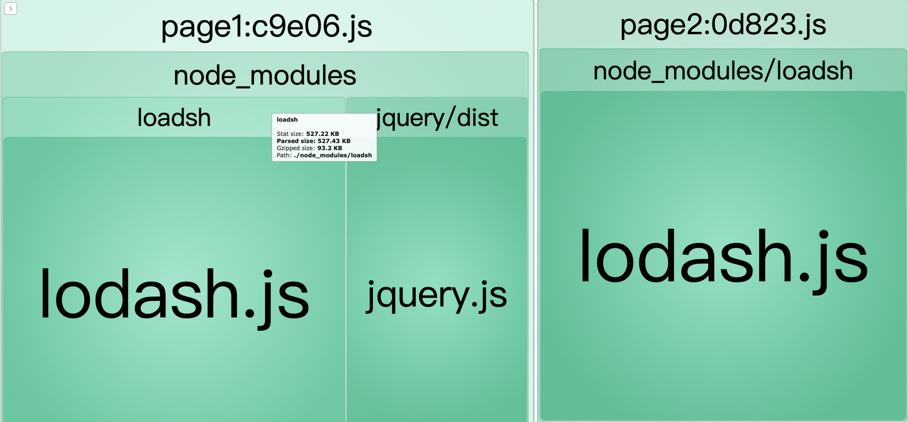

# 学习笔记-webpack splitChunk分包

## 前置：为什么需要分包？
先看本项目中不加分包优化的打包结果：两个入口文件都依赖了loadsh，在最后的打包结果中，loadsh一模一样的代码存在于两份打包目录中；这意味着生产环境上用户的两次请求都会包含有关loadsh的重复代码；更好的做法是把loadsh抽离出来独立打包，这样也能有效利用缓存，因为这种库一般项目内都不会怎么更新，每次发版后依旧能使用之前的缓存。

