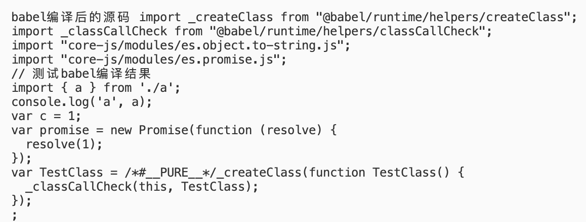

<!-- @import "[TOC]" {cmd="toc" depthFrom=2 depthTo=4 orderedList=false} -->

<!-- code_chunk_output -->

- [1、babel能独立工作吗？](#1-babel能独立工作吗)
- [2、babel的作用是什么？](#2-babel的作用是什么)
- [3、安装了babel就能自动转换代码吗？](#3-安装了babel就能自动转换代码吗)
- [4、 @babel/polyfill、@babel/preset-ent、@babel/plugin-transform-runtime](#4--babelpolyfill-babelpreset-ent-babelplugin-transform-runtime)
  - [@babel/preset-env](#babelpreset-env)
    - [前置：corejs和@babel/polyfill之间的关系](#前置corejs和babelpolyfill之间的关系)
    - [@babel/preset-env useBuiltIns配置](#babelpreset-env-usebuiltins配置)
  - [@babel/plugin-transform-runtime](#babelplugin-transform-runtime)
- [5、babel-plugin](#5-babel-plugin)
  - [AST](#ast)
  - [babel插件前置：@babel/parser](#babel插件前置babelparser)
  - [babel插件前置：babel的历史演变](#babel插件前置babel的历史演变)
  - [babel插件的分类](#babel插件的分类)
  - [babel插件的写法](#babel插件的写法)
- [6、babel模块化](#6-babel模块化)
  - [modules: "auto"](#modules-auto)
  - [modules: false](#modules-false)
  - [modules: "commonjs" / "cjs"](#modules-commonjs--cjs)

<!-- /code_chunk_output -->


## 1、babel能独立工作吗？
> 可以，babel和postcss这些库一样既能与构建工具合作，也能独立工作。

```bash
npm i -D @babel/core @babel/cli
# cli
babel 需要编译的文件路径 -o 编译后的文件路径
babel 需要编译的文件夹路径 -d 编译后的文件夹路径
```
## 2、babel的作用是什么？
> 不同的浏览器能识别的ES标准并不相同(低版本浏览器中没有Promise等API和箭头函数等新语法)。
> 这就导致了如果我们代码中使用了一些ES新版本的api和语法有的浏览器认识，有的浏览器就不认识。
> babel的出现就是为了解决这一问题，写代码时不用考虑语法api的兼容，最终由babel统一编译为能被各种浏览器识别的代码。

## 3、安装了babel就能自动转换代码吗？
> babel本身(@babel/core)只提供一些代码分析功能，**最终的代码转换依赖各种babel插件**。

基于第一点中搭建好的环境，可以证实该结论：
```javascript
// 转换前的代码，用到了新的语法：const、箭头函数；新的api: Promise
const a = 1;
const func = () => { console.log(a); };
const promise = new Promise(resolve => {
    resolve(1);
});

// 执行babel cli 得到编译后的结果
const a = 1;
const func = () => {
  console.log(a);
};
const promise = new Promise(resolve => {
  resolve(1);
});

```
可以看见，不论是新的语法或者api都没有被转换成兼容代码
语法和api的转换依赖各种插件和预设：`@babel/polyfill、@babel/preset-ent、@babel/plugin-transform-runtime`

## 4、 @babel/polyfill、@babel/preset-ent、@babel/plugin-transform-runtime
>
### @babel/preset-env
`@babel/preset-env`是babel众多预设中的其中一个。
什么是预设？项目中使用到babel通常不会只有仅仅几个插件，如果这些插件都一个个安装配置将会非常繁琐。预设就是babel官方把一些常用的插件整合到一起统一提供。针对不同的JS框架或者语言都有对应的预设，比如`preset-react`、`preset-typescript`。
接下来加入预设看一下转换后的结果：
```shell
# .babelrc
{
    "presets": ["@babel/preset-env"],
    "plugins": []
}
# .browserslistrc
> 1%
last 2 versions
not ie <= 8
```
```javascript
// 转换前的代码，用到了新的语法：const、箭头函数；新的api: Promise
const a = 1;
const func = () => { console.log(a); };
const promise = new Promise(resolve => {
    resolve(1);
});

// 转换后的代码
"use strict";
var a = 1;
var func = function func() {
  console.log(a);
};
var promise = new Promise(function (resolve) {
  resolve(1);
});
```
加入预设之后，**新的语法已经被转换，但是新的api仍未被处理。**
如果需要转换api，则需要用的`@babel/preset-env`中`useBuiltIns`和`corejs`两个配置：
#### 前置：corejs和@babel/polyfill之间的关系
`corejs`身是一个独立的工具库，包含所有ES新版本api的实现，作为babel预设配置项时表示要使用的corejs版本。
`@babel/polyfill`就是把`corejs@2`和`regenerator-runtime`(asynic await代码兼容转换工具库)整合到一起。
但babel7.4.0版本后，@babel/polyfill在`@babel/preset-env中配置corejs: 3`时**不再生效**。官网推荐直接安装使用`corejs@3`版本和`regenerator-runtime`

#### @babel/preset-env useBuiltIns配置

1.  `useBuiltIns：false`：默认配置。只转换语法，不转换api。当useBuiltIns为false时，`corejs`配置不生效。
2. `useBuiltIns："entry"`：根据配置的浏览器兼容条件(.browserslistrc)引入所有缺少的api；
```json
{
  "presets": [
        ["@babel/preset-env", {
            "useBuiltIns": "entry",
            "corejs": 2
        }]
    ],
}
```
当配置为`entry`时需要指定corejs版本，默认为2；还需要在入口文件中手动添加`import '@babel/polyfill'`
```javascript
// 转换前的代码
import '@babel/polyfill';
const a = 1;
const func = () => { console.log(a); };
const promise = new Promise(resolve => {
    resolve(1);
});

// 转换后的代码
"use strict";
require("core-js/modules/es6.array.copy-within.js");
require("core-js/modules/es6.array.fill.js");
require("core-js/modules/es6.array.filter.js");
require("core-js/modules/es6.array.find.js");
require("core-js/modules/es6.array.find-index.js");
require("core-js/modules/es7.array.flat-map.js");
// ...一共引入了131行

var a = 1;
var func = function func() {
  console.log(a);
};
var promise = new Promise(function (resolve) {
  resolve(1);
});

```
不符合兼容范围的api都会被引入进来
注意：
   - `@babel/polyfill`需要开发者手动安装，因为它本身会依赖`corejs@2`和`regenerator-runtime`所以这两个不用再额外安装。
   - 如果配置`corejs: 3`，前面提到过`@babel/polyfill`只支持`corejs@2`版本并且已经过时，所以需要在项目中自己安装`corejs@3`和`regenerator-runtime`，并且在入口文件中添加`import "core-js/stable";`

3. `useBuiltIns："usage"`：仅按需引入用到的需要兼容的新版本api，上一个配置中会引入很多没用到的api，这样会导致最终项目体积增大。

当配置为"usage"时也需要指定corejs版本，不指定默认为`corejs: 2`；因为是按需引入，所以**不需要**在入口文件中添加`import '@babel/polyfill'`（该安装还是得安装）
```json
{
  "presets": [
        ["@babel/preset-env", {
            "useBuiltIns": "usage",
            "corejs": 2
        }]
    ],
}
```
```javascript
// 转换前的代码
const a = 1;
const func = () => { console.log(a); };
const promise = new Promise(resolve => {
    resolve(1);
});

// 转换后的代码
"use strict";
require("core-js/modules/es6.object.to-string.js");
require("core-js/modules/es6.promise.js");
var a = 1;
var func = function func() {
  console.log(a);
};
var promise = new Promise(function (resolve) {
  resolve(1);
});
```
可以看到最终代码干净了不少
再次强调：如果配置`corejs: 3`，那将不再依赖`@babel/polyfill`，需要开发者在项目中手动安装`corejs@3`和`regenerator-runtime`(不用在入口中引入，`"useBuiltIns": "usage"`会按需注入)

### @babel/plugin-transform-runtime
基于以下配置来看一个问题：
```json
{
    "presets": [
        ["@babel/preset-env", {
            "useBuiltIns": "usage",
            "corejs": 3
        }]
    ],
    "plugins": []
}
```
```javascript
// 转换前的代码
class A {};
const func = () => { console.log(a); };
const promise = new Promise(resolve => {
    resolve(1);
});

// 转换后的代码
"use strict";
require("core-js/modules/es.object.to-string.js");
require("core-js/modules/es.promise.js");
function _defineProperties(target, props) { for (var i = 0; i < props.length; i++) { var descriptor = props[i]; descriptor.enumerable = descriptor.enumerable || false; descriptor.configurable = true; if ("value" in descriptor) descriptor.writable = true; Object.defineProperty(target, descriptor.key, descriptor); } }
function _createClass(Constructor, protoProps, staticProps) { if (protoProps) _defineProperties(Constructor.prototype, protoProps); if (staticProps) _defineProperties(Constructor, staticProps); Object.defineProperty(Constructor, "prototype", { writable: false }); return Constructor; }
function _classCallCheck(instance, Constructor) { if (!(instance instanceof Constructor)) { throw new TypeError("Cannot call a class as a function"); } }
var A = /*#__PURE__*/_createClass(function A() {
  _classCallCheck(this, A);
});
;
var func = function func() {
  console.log(a);
};
var promise = new Promise(function (resolve) {
  resolve(1);
});
```
转换后的代码生成了很多_开头的helper辅助函数，这些函数会在不同文件的编译结果中重复声明，显然是不好的，应该把它们统一提取出来。利用`@babel/plugin-transform-runtime`插件就能实现这样的效果。
```json
{
    "presets": [
        ["@babel/preset-env", {
            "useBuiltIns": "usage",
            "corejs": 3
        }]
    ],
    "plugins": ["@babel/plugin-transform-runtime"]
}
```
```javascript
// 转换后的代码
"use strict";

var _interopRequireDefault = require("@babel/runtime/helpers/interopRequireDefault");
require("core-js/modules/es.object.to-string.js");
require("core-js/modules/es.promise.js");
var _createClass2 = _interopRequireDefault(require("@babel/runtime/helpers/createClass"));
var _classCallCheck2 = _interopRequireDefault(require("@babel/runtime/helpers/classCallCheck"));
var A = /*#__PURE__*/(0, _createClass2.default)(function A() {
  (0, _classCallCheck2.default)(this, A);
});
;
var func = function func() {
  console.log(a);
};
var promise = new Promise(function (resolve) {
  resolve(1);
});
```
现在所有_开头的辅助函数都被提取到了公共的helper中；
但是`require("core-js/modules/es.promise.js");`这一行代码会在全局范围内引入promise，这样会导致全局变量污。如果是工具库的开发，肯定是不能污染全局变量的。
`@babel/plugin-transform-runtime`的功能不仅仅包括公共函数的提取，也包含：

1. **按需提供polyfill**（与`@babel/preset-env：useBuiltIns: "usage"`类似）
2. **polyfill新版api时不污染全局**
3. 提取公共helper函数

**所以当我们在开发工具库或者不想让polyfill函数污染全局时：**
```json
{
    "presets": [
        ["@babel/preset-env"]
    ],
    "plugins": ["plugins": [["@babel/plugin-transform-runtime", {
        "corejs": 3
    }]]]
}
```
```javascript
// 转换后的代码
"use strict";

var _interopRequireDefault = require("@babel/runtime-corejs3/helpers/interopRequireDefault");
var _promise = _interopRequireDefault(require("@babel/runtime-corejs3/core-js-stable/promise"));
var _createClass2 = _interopRequireDefault(require("@babel/runtime-corejs3/helpers/createClass"));
var _classCallCheck2 = _interopRequireDefault(require("@babel/runtime-corejs3/helpers/classCallCheck"));
var A = /*#__PURE__*/(0, _createClass2.default)(function A() {
  (0, _classCallCheck2.default)(this, A);
});
;
var func = function func() {
  console.log(a);
};
var promise = new _promise.default(function (resolve) {
  resolve(1);
});
```
`@babel/preset-env`使用默认配置`useBuiltIns: false`仅提供语法的转换，api层面的转换交给`@babel/plugin-transform-runtime`。
这样一来代码中不再直接`require("core-js/modules/es.promise.js");`而是放在了新的变量`_promise `中。既实现了按需注入，也不会污染全局。注意：编译后的代码依赖`@babel/runtime-corejs3`所以需要自行`npm i -S @babel/runtime-corejs3`
**在开发业务项目时，可以忽略全局污染问题，让**`@babel/plugin-transform-runtime`**仅提供提取helper功能：**
```json
{
    "presets": [
        ["@babel/preset-env", {
            "useBuiltIns": "usage",
            "corejs": 3
        }]
    ],
    "plugins": ["@babel/plugin-transform-runtime"]
}
```

## 5、babel-plugin
babel工作流程简图：


### AST

**前置：ESTree规范**
- AST最终是由js解析器解析而成，但要解析js语法，就需要制定明确的规范，比如函数声明、函数执行、变量声明等如何通过js树形对象表示出来
- 如果没有AST规范，那么肯定无法造出js解析器；如果AST规范不统一，那么依赖不同解析器的工具库之间就不能互通有无
- 而ESTree就定义了官方的AST解析规范，目前由社区和Mozilla共同维护，ESTree：https://github.com/estree/estree

**一些知名的js解析器**
1. `acorn`：webpack御用解析器，符合ESTree规范
2. `@babel/parser`：babel官方解析器，前身babylon，fork于acron；改名@babel/parser后不再遵循ESTree规范，但其构建了非常强大的插件体系
3. `uglify-js`：主要用于代码混淆压缩，自己实现了一套AST规范，也正因为是其内部规范不是标准的ESTree，ES6以后新语法的AST都不支持（不认识const 、箭头函数），所以没有办法压缩混淆ES6+代码
  
注意：至今仍没有明确的规定要求AST必须长什么样子，也没有要求所有解析器使用统一的AST规范；只要你能用预先制定好的规则（AST规范）描述源代码中的语法，并得到对应的树形结构（AST），那都是合理合适的，它是一个上层的抽象概念。比如Vue的模板语法，因为是框架内独有的模板，所以Vue内部实现了一套自己的AST规范与AST解析器，解析v- 指令等语法，最终得到框架模板专属的AST

AST在线解析工具，支持多种解析器解析：https://astexplorer.net/

### babel插件前置：@babel/parser
前面提到过，babel的AST生成依赖`@babel/parser`解析器

```js
// 测试babel-parser
const parser = require('@babel/parser');
const ast = parser.parse('const a = 1');
console.log(ast);
```

输出如下：


==此外，`@babel/parser`支持解析的语法很多，但大多数默认为关闭状态，当需要使用时，可以用插件来打开对应的解析能力==

```js
// 在不适用任何插件时，以下的解析会报错，因为解析器现在还不认识ts语法
const parser = require('@babel/parser');
const ast = parser.parse('const a: number = 1'); // ts代码
console.log(ast);

// 添加plugin让@babel/parser打开ts语法解析功能
const parser = require('@babel/parser');
const ast = parser.parse('const a: number = 1', { plugins: ['typescript'] });
console.log(ast);
```

### babel插件前置：babel的历史演变

ES官方每年都会推出新的语法、API和不计其数的新特性提案，并且这些提案采用一种基于stage的“渐进式”演进模式。

一种新的语法orAPI从提案到变成正式标准，需要经历五个阶段。每个阶段的变动都需要由 TC39 委员会批准。

- Stage 0 - Strawman（展示阶段）
- Stage 1 - Proposal（征求意见阶段）
- Stage 2 - Draft（草案阶段）
- Stage 3 - Candidate（候选人阶段）
- Stage 4 - Finished（定案阶段）

在这种模式下会出现两个问题：
  1. 优秀的提案进度缓慢，迟迟不能成为官方标准；
  2. 浏览器的实现速度跟不上官方的脚步，有些已经成为标准的语法，在现代浏览器中依然没有获得支持；

==babel的存在，使得该模式可以没有包袱的前进。==

在babel7以前，**babel预设是以阶段区分的**，比如`babel-preset-stage-2`，处于草案阶段的都会被收入其中；
当特性成为标准时会加入到`babel-preset-es20xx`中，但由于`babel-preset-esxxxx`每年都需要更新难以维护；所以babel7开始，babe将所有的`babel-preset-esxxxx`统一为`@babel/preset-env`；
当特性成为最终标准时对应的插件也会被加入到`@babel/preset-env`

并且插件不再以stage阶段来分类，而是用transform、syntax、proposal根据插件的功能（语义）分类来实现对不同特性的支持。

### babel插件的分类
可参考的文档: https://zhuanlan.zhihu.com/p/61780633

以下插件均来自`@babel/preset-env`

**1、plugin-syntax 语法插件：**

帮忙往`@babel/parser`中添加plugins配置，这些插件并不具有功能性，因为对应的语法解析其实早已在`@babel/parser`中实现，这些插件只是帮忙打开相关的解析功能而已


**2、plugin-transform/plugin-proposal 转换插件、提案插件：**


转换插件用于`@babel/core`，对AST抽象语法树进行操作，主要体现在将新版的代码写法转换为现在版本浏览器支持的写法。

plugin-transform开头代表官方正式已成为标准的转换插件，plugin-proposal代表该插件的语法还处于提案阶段

**提案插件**既可能是语法插件也可能是转换插件，因为它的目的就是让开发者能够抢先使用某些新语法或者新API，当它最终形成正式标准时，官方会根据其功能特性推出对应的语法插件或转换插件，甚至同时推出对应的语法插件和转换插件

`@babel/preset-env`中都是已成为标准的语法，但为什么会出现plugin-proposal插件呢？
- 在`@babel/preset-env`中的提案插件一定已经有了对应的正式版插件，一般情况下`@babel/preset-env`会很快在后续的版本迭代中移除掉提案插件，暂时不太清楚为什么babel官方要将提案插件和其对应的正式插件短暂地同时放在预设中，可能是为了避免插件阶段转换期间有bug

### babel插件的写法
```js
module.exports = function({ types: babelTypes }) {
  return {
      // 钩子函数（写法和vue的自定义指令其实很像）
      visitor: {
          // 对type的操作
          // path: 包含了当前节点的所有信息以及可操作节点的API
          // state: 当前作用域内的信息
          CallExpression(path, state) {}
      }
  }
}
```

**proposal-function-bind简单实现**

插件描述：https://babeljs.io/docs/babel-plugin-proposal-function-bind

```js

// 需要在babel配置中添加插件打开相应的语法解析
"parserOpts": {
  "plugins": ["functionBind"]
}

module.exports = function () {
  return {
      visitor: {
          CallExpression(path) {
              const node = path.node;
              const bindExpression = node.callee
              if (bindExpression.type !== 'BindExpression') {
                  return;
              }
              const bindContext = bindExpression.object.name;
              const funcName = bindExpression.callee.name;
              const replacement = `${funcName}.call(${bindContext})`; // test.call(obj)
              path.replaceWithSourceString(replacement);
          }
      }
  }
}
```

## 6、babel模块化

上述示例中转换后的代码都是`commonjs`语法，如何控制转换后代码的模块化语法呢？
> 通过`@babel/preset-env.modules`配置控制

`modules`配置默认为`'auto'`，常用的配置有`'cjs'`(`'commonjs'`别名)、`false`

### modules: "auto"

当配置为`modules: 'auto'`时，在==babel-cli环境==下的编译结果：
```js
// .babelrc
{
  "presets": [
        ["@babel/preset-env", {
            "modules": "auto",
            "corejs": 3,
            "useBuiltIns": "usage"
        }]
    ],
    "plugins": [["@babel/plugin-transform-runtime"]]
}
```

```js
// a.js
export const a = 'a';
export const b = 'b';

// 1、转换前的代码，esModule模块化
import { a } from './a.js';
console.log('a', a);
const a = 1;
const promise = new Promise(resolve => {
    resolve(1);
});
class TestClass {};
```

转换后的结果：esModule语法被转换为cjs模块化


```js
// 2、转换前的代码，cjs模块化
const { a }  = require('./a');
console.log('a', a);
const a = 1;
const promise = new Promise(resolve => {
    resolve(1);
});
class TestClass {};
```

转换后的结果：保持cjs模块化


综上，在babel-cli运行环境下，`modules: 'auto'`无论转换前使用哪种模块化语法，都将被转换为cjs模块化；

那么这个`'auto'`到底是怎么个自适应法呢？
参考中文官网对该配置的解释：https://www.babeljs.cn/docs/babel-preset-env#modules
该配置项会根据`caller`来决定最终使用哪一种模块化语法

关于`caller`: https://www.babeljs.cn/docs/options#caller
可简单理解为一个配置项，告诉babel当前环境对一些特性的支持程度


**`caller`如何注入？**

- 根据官网介绍，babel-cli环境无法通过命令行参数指定`caller`

- 当通过编程方式调用babel时，可用参数传递
  ```js
  babel.transformFileSync("example.js", {
    caller: {
      name: "my-custom-tool",
      supportsStaticESM: true,
    },
  });
  ```
- 通过构建工具(webpack/rollup等)使用babel时，`babel-loader`、`@rollup/plugin-babel`等会自动注入caller

接下来在==webpack环境==中看看`modules: 'auto'`的表现：

**前置：**
**1、babel-loader注入的`caller`长啥样？**

> 
> 看上去babel-loader都会统一注入支持ESM，所以在webpack环境下，如果不更改babel预设中的modules配置，默认'auto', babel最终转换后的模块化语法都是esModule
> 注意：上图基于webpack5、babel7

**2、webpack模块化**

> 各种编译器普遍都是兼容了esm和cjs两种模块化语法，但需要注意的是，在webpack中使用babel时，源代码是先交给babel-loader转换，最后webpack编译器拿到的源码已经是babel-loader转换过的；
> 源码 -> babel-loader -> babel转换根据配置转为esm/cjs模块化代码 -> webpack根据esm/cjs模块化做不同的兼容处理(\_\_webpack_require\_\_)

**3、tree-shaking**

> 众所周知，esm才能支持tree-shaking，而cjs是不行的，所以babel-loader最终的转换结果对webpack的>tree-shaking也会有影响
> tree-shaking的一些参考文章，更多可参考语雀，里面有相关知识点总结：
> https://juejin.cn/post/7052901120209289246
> https://juejin.cn/post/7105022295474700295

webpack生产环境(`mode: production`)下，`optimization.minimize: true` 默认开启tree-shaking
```js
// 开发环境下如何打开tree-shaking
optimization: {
  usedExports: true, // 会为判断为dead code的代码片段打上标记
  // minimize: true, // 压缩打包后的代码，并且会删除打上标记的代码（不压缩可以注释）
},
```

**4、一个babel模块化转换的小细节**
> 任何环境，babel都是没有提供类似`modules: "esmodule"`的配置，所以是没有办法能将你代码中的`const { a } = require('./a')` 转换为 `import { a } from './a'`的，哪怕是`modules: false`也不行，它只能保证babel帮你导入的垫片API使用esm模块化语法
> 所以如果你决定使用tree-shaking的能力，那也得保证自身的业务代码==完全使用esm语法==，不能依赖编译器
> 另一方面，`import { a } from './a'` 转换为 `const { a } = require('./a')` babel是可以办到的，`modules: "cjs"`

接下来探究当配置为`modules: 'auto'`时，在==webpack环境==下的模块化编译结果
```js
// a.js
export const a = 'a';
export const b = 'b';

// 入口文件
import { a } from './a.js';
console.log('a', a);
const a = 1;
const promise = new Promise(resolve => {
    resolve(1);
});
class TestClass {};
```
按照上文，webpack环境中babel-loader注入的`caller`是支持esm的，所以babel转换后的结果为：



webpack最终生成的打包文件中，由于满足tree-shaking的条件，所以`export const b = 'b'`会被标记被dead code：


当然上述例子中如果业务代码是如下，前面提到过babel是不具备cjs -> esm 的能力的，所以`const { a } = require('./a');`在babel的转换结果中将会被保留下来，后续的tree-shaking自然也会失效
```js
const { a } = require('./a'); // cjs写法
console.log('a', a);
const a = 1;
const promise = new Promise(resolve => {
    resolve(1);
});
class TestClass {};
```

到这，基本已经解释清楚了`modules: "auto"`配置的含义。

### modules: false

简单来讲，该配置具有如下作用

- babel导入的垫片API将使用esm语法
- **不改变业务代码中本身的模块化写法**，多次强调该配置不会将cjs -> esm，更不会将esm -> cjs

### modules: "commonjs" / "cjs"

- babel导入的垫片API将使用cjs语法
- **如果业务代码是esm语法，改为cjs**
